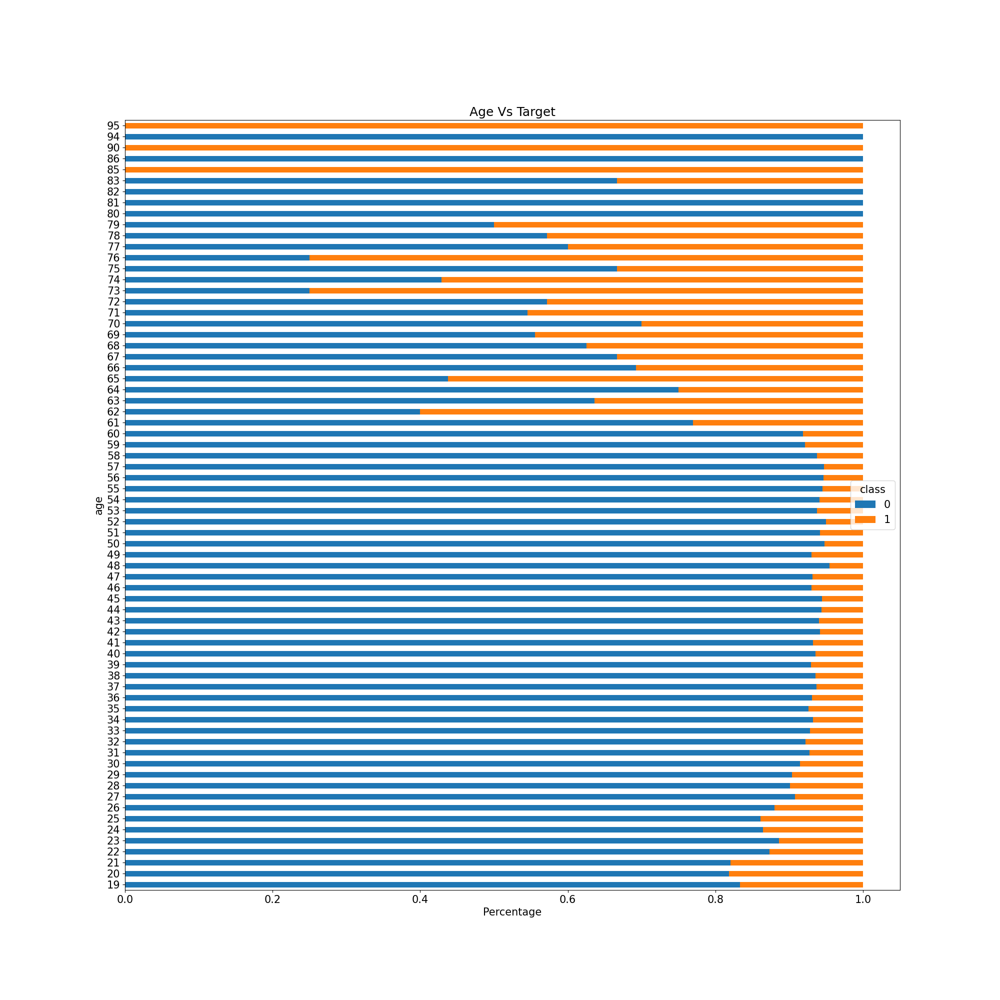
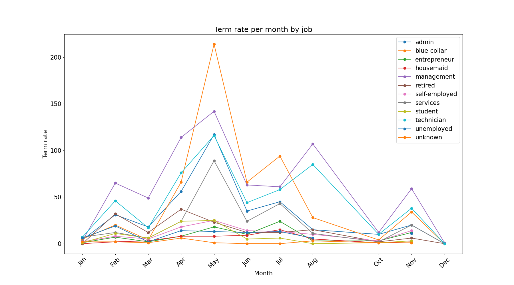
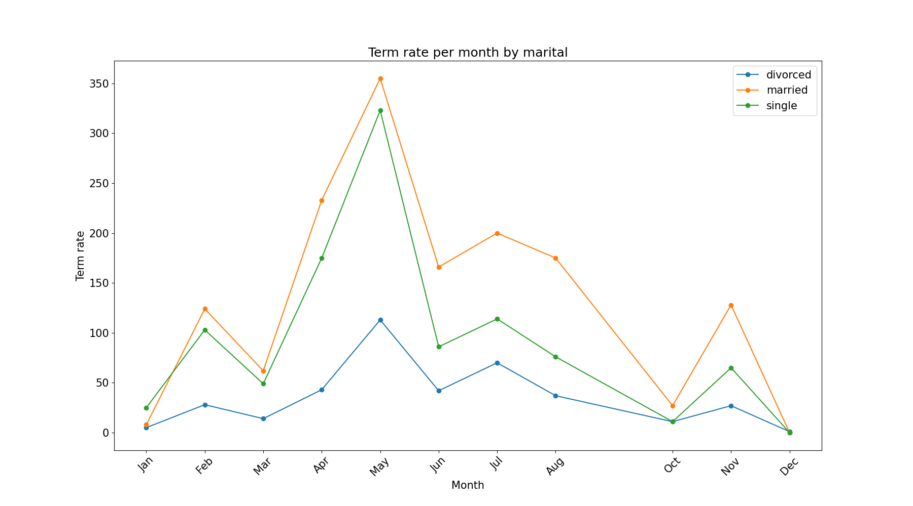

# Term Deposit Marketing

Data Description:
The data comes from direct marketing efforts of a European banking institution. The marketing campaign 
involves making a phone call to a customer, often multiple times to ensure a product subscription, in this 
case a term deposit. Term deposits are usually short-term deposits with maturities ranging from one 
month to a few years. The customer must understand when buying a term deposit that they can 
withdraw their funds only after the term ends. All customer information that might reveal personal 
information is removed due to privacy concerns.

## Exploratory Data Analysis

### Age Vs Target

- Ages 85, 90, and 95 had 100% Term deposit subscription rate, however, there were only 3 customers age 85 and one customer each of ages 90 and 95
- Ages 61 to 79 had a good amount of subscription rate

### Housing Vs Target

- Customers without housing has a slightly greater chance of subscribing to term deposit

### Duration Vs Target

### Term rate per month

- There are more subscriptions between April and August, with the highest rates in May

### Top 20 Feature Importance for XGBoost Classifier

- Duration is the most important feature
- Month is also very important, especially April and March
- Customers with no housing are more likely to subscribe to term deposit

